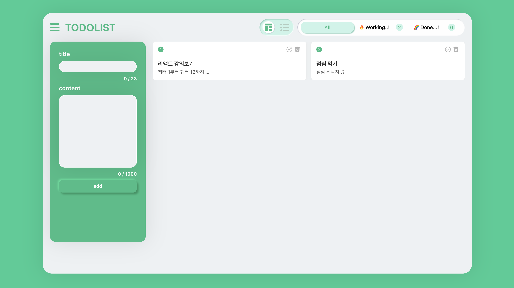

# TO-DO LIST

## 프로젝트 개요

react TO-DO-LIST 사용자가 할 일 목록을 관리할 수 있는 웹 애플리케이션입니다.

## 배포

📎[TO-DO LIST](https://hh99-chap2-ver2-6s2z.vercel.app/)



## 구현 기능

---

- TODO 추가 : TODO 제목과 상세내용을 입력하고 저장
- TODO 수정 : TODO 상세페이지에서 TODO의 내용을 수정
- TODO 삭제 : TODO를 삭제할 수 있습니다.
- TODO 완료/미완료 표시 : 체크 아이콘을 클릭하여 완료/미완료 TODO를 구별
- TODO 필터링 : 전체 TODO, 완료 TODO, 미완료 TODO를 필터링 하여 페이지에 보여줌
- TODOLIST 레이아웃 전환 : 레이아웃 변환 토글 버튼을 통해 card, list 2가지 레이아웃 제공

<br />
<br />
<br />

## 프로젝트 구조

---

### 페이지 구성

- 메인페이지
- 상세페이지
- 수정페이지

<br />
<br />

### 컴포넌트 구조

```
node_modules/
public/
    index.html
src/
    components/
        common/                     : 공통 UI 요소 스타일 컴포넌트 폴더
            Block/
            Box/
            Button/
            Input/
        todo/                       : todo UI 컴포넌트 파일
            TodoDetail.jsx
            TodoInsert.jsx
            TodoList.jsx
            TodoListItem.jsx
            TodoTemPlate.jsx
            TodoUpdate.jsx
    containers/                     : 컴포넌트 컨테이너
        TodoDetailContainer.jsx
        TodoInsertContainer.jsx
        TodoListContainer.jsx
        TodoToggleContainer.jsx
        TodoUpdateContainer.jsx
    lib/                            : 이미지 파일 등 리소스 파일
        assets/
    pages/                          : 페이지 컴포넌트
        Detail.jsx
        Main.jsx
        Update.jsx
    redux/                          : 리덕스
        config/                     : 리덕스 스토어
        modules/                    : action values, action creators, reducer
          selectChange.js
          todos.js
          toggle.js
    utils/
        GlobalStyle.jsx             : 글로벌 스타일 정의
    App.js
    index.js
```

<br />
<br />
<br />

## 프로젝트 라이센스 정보 명시

---

[fontawesome](https://fontawesome.com/) <br />
[pinterest](https://www.pinterest.co.kr)

<br />
<br />
<br />

## 작성자

---

- 김민승
- 김혜경
